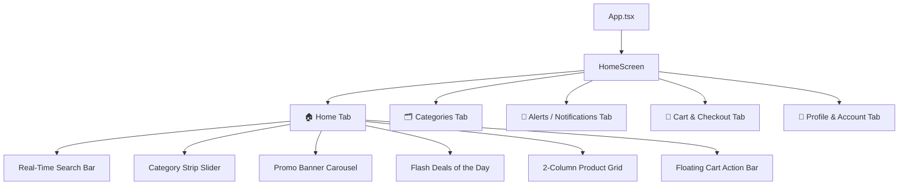

# Kids_App — MathiraKids Kids Mart React Native Mobile App

<p align="center">
  
</p>

<p align="center">
  <b>A modern, high-performance, pastel-themed E-Commerce Mobile Application for Kids' Fashion, Toys, Footwear, and Accessories.</b>
</p>

<p align="center">
  
  
  
  
  
</p>

---

## 📖 Table of Contents

- [✨ Key Features](#-key-features)
- [🎨 Design & Theme Aesthetics](#-design--theme-aesthetics)
- [📁 Project Architecture & File Structure](#-project-architecture--file-structure)
- [📱 Screens & Navigation Overview](#-screens--navigation-overview)
- [🔌 Backend & REST API Integration](#-backend--rest-api-integration)
- [⚙️ Tech Stack & Dependencies](#️-tech-stack--dependencies)
- [🚀 Getting Started](#-getting-started)
  - [Prerequisites](#prerequisites)
  - [Installation](#installation)
  - [Running the App](#running-the-app)
- [🌐 Ecosystem](#-ecosystem)
- [📄 License](#-license)

---

## ✨ Key Features

- 👶 **Kids Fashion Pastel Design System**: Custom curated bubblegum pink, baby blue, and sunshine gold palette designed specifically for kids & parents.
- 🔍 **Instant Search & Real-Time Filtering**: Search across names, descriptions, age groups, and specifications with instantaneous query matching.
- 🏷️ **Category Strip with Vector Icons**: Smooth horizontal category slider featuring vector icons for Girls, Boys, Footwear, Toys, Ethnic Wear, Party Dresses, and Baby Care.
- 🎠 **Promotional Hero Banner Carousel**: Swipeable promotional slider with dot indicators, countdowns, and one-tap promo coupon activation (e.g. `KIDS50`).
- 🔥 **Deals of the Day & Quick Filters**: Flash deal countdowns with filter chips for *All Offers*, *Flash Deals*, *Top Rated (4.7+ ★)*, and *Assured Quality*.
- 🛍️ **Interactive 2-Column Product Grid**: Product cards with age badges, discount percentages, wishlist heart bookmarking, star ratings, and inline +/- quantity selectors.
- 🛒 **Floating Cart & Bill Summary**: Real-time floating cart pill bar and full shopping bag screen with itemized pricing, delivery discounts, and single-click checkout.
- 🔔 **Alerts & Notification Feed**: Order status tracking, festival offer announcements, and loyalty Sparks points rewards.
- 👤 **VIP Kids Club Profile**: Account details, order history shortcuts, saved addresses, payment methods, and Sparks loyalty balance (680 Sparks).
- 🔄 **Hybrid Online/Offline Data Architecture**: Connects seamlessly with the local Express REST API, with fallback to an offline mock dataset if the backend is unreachable.

---

## 🎨 Design & Theme Aesthetics

All colors and visual tokens are defined in [`src/constants/Colors.ts`](./src/constants/Colors.ts):

| Token | Hex Code | Preview | Description |
| :--- | :--- | :--- | :--- |
| **`primary`** | `#FF6B8B` |  | Bubblegum Pink (Brand Primary) |
| **`primaryDark`** | `#E04869` |  | Dark Rose Accent |
| **`secondary`** | `#4A90E2` |  | Soft Baby Blue |
| **`accent`** | `#FFC048` |  | Sunshine Gold / VIP Highlights |
| **`background`** | `#FFF7F9` |  | Soft Warm Pastel Background |
| **`surface`** | `#FFFFFF` |  | Pure White Card Surface |
| **`ratingGreen`** | `#2ECC71` |  | Verified Green Rating Badges |
| **`textPrimary`** | `#2C3E50` |  | Slate Charcoal Primary Typography |

---

## 📁 Project Architecture & File Structure

```text
MathiraKids/
├── assets/                       # App icons, splash screens & adaptive icons
│   ├── icon.png
│   ├── splash.png
│   ├── android-icon-foreground.png
│   └── android-icon-background.png
├── src/
│   ├── components/               # Modular, reusable UI components
│   │   ├── BannerSlider.tsx      # Swipeable hero promo carousel
│   │   ├── BottomNav.tsx         # 5-tab custom navigation bar
│   │   ├── CartBar.tsx           # Floating quick-cart action pill
│   │   ├── CategoryCard.tsx      # Vector circular category chips
│   │   ├── Header.tsx            # Brand header, Sparks badge, delivery bar
│   │   ├── ProductCard.tsx       # 2-column product card with wishlist & cart controls
│   │   └── SearchBar.tsx         # Search input with clear and media icons
│   ├── constants/                # Theme colors & fallback seed datasets
│   │   ├── Colors.ts             # Centralized design system color palette
│   │   └── mockData.ts           # Product, Category, and Banner interfaces & seed data
│   ├── screens/                  # Application screens
│   │   └── HomeScreen.tsx        # Multi-tab view container (Home, Categories, Alerts, Cart, Profile)
│   └── services/                 # Network & API communication
│       └── api.ts                # Axios HTTP client connecting to Express API
├── App.tsx                       # Root React application component
├── app.json                      # Expo configuration & app metadata
├── index.ts                      # Expo entry point
├── package.json                  # Dependencies & npm scripts
├── tsconfig.json                 # TypeScript compiler configuration
└── README.md                     # Project documentation
```

---

## 📱 Screens & Navigation Overview

The app utilizes a 5-tab bottom navigation layout managed seamlessly inside [`HomeScreen.tsx`](./src/screens/HomeScreen.tsx):



1. **Home Tab (`home`)**:
   - Header with VIP Kids Club badge and Sparks points counter.
   - Pincode & Express delivery status bar.
   - Instant Search Bar & category selector.
   - Hero banner slider & Flash Deals countdown.
   - Product Grid with cart increment/decrement & wishlist bookmarking.

2. **Categories Tab (`categories`)**:
   - Grid layout of all department categories (Girls Wear, Boys Wear, Footwear, Toys, Party Wear, Ethnic Wear, Baby Care).

3. **Notifications Tab (`notifications`)**:
   - Updates on live sales, delivery dispatch notifications, and credited Sparks.

4. **Cart Tab (`cart`)**:
   - Full bag overview with thumbnail previews, item multipliers, delivery fee waivers, and direct Order Placement.

5. **Profile Tab (`profile`)**:
   - Customer account overview, quick links to Orders, Wishlist, Sparks Zone, Saved Addresses, and Payment Methods.

---

## 🔌 Backend & REST API Integration

The app connects to the **MathiraKids Kids Mart REST API** (`MathiraKidsAPI`) via [`src/services/api.ts`](./src/services/api.ts):

* **Default Base URL:** `http://localhost:5001/api`

### Configured Endpoints:

| Method | Endpoint | Description |
| :--- | :--- | :--- |
| `GET` | `/categories` | Fetches all active department categories |
| `GET` | `/banners` | Fetches promotional marketing banners |
| `GET` | `/products` | Retrieves catalog (supports `?category=`, `?search=`, `?isDealOfDay=`) |
| `POST` | `/orders` | Places a customer order with items payload |
| `POST` | `/auth/login` | Authenticates user with email & password |
| `POST` | `/auth/register` | Creates a new user profile |
| `GET` | `/auth/me` | Fetches authenticated user account details |

> [!NOTE]
> If the API server is offline or unreachable, `MathiraKids` gracefully falls back to the high-quality seed dataset in [`src/constants/mockData.ts`](./src/constants/mockData.ts) without interrupting user interaction.

---

## ⚙️ Tech Stack & Dependencies

- **Framework**: [Expo (v54.0.0)](https://expo.dev/)
- **Core Library**: [React Native (0.81.5)](https://reactnative.dev/) / [React 19](https://react.dev/)
- **Language**: [TypeScript (5.3.3)](https://www.typescriptlang.org/)
- **Icons**: [@expo/vector-icons (15.0.3)](https://icons.expo.fyi/) (*Ionicons*, *MaterialCommunityIcons*)
- **Networking**: [Axios (1.7.9)](https://axios-http.com/)
- **State & Layout**: Safe Area Context, React Hooks (`useMemo`, `useState`, `useEffect`)
- **Animation & Gestures**: React Native Reanimated & Gesture Handler

---

## 🚀 Getting Started

### Prerequisites
- [Node.js](https://nodejs.org/) (v18 or higher recommended)
- [npm](https://www.npmjs.com/) or [yarn](https://yarnpkg.com/)
- [Expo Go App](https://expo.dev/go) installed on your physical mobile device (iOS or Android) or an emulator (Android Studio / Xcode).

### Installation

1. **Navigate to the MathiraKids directory:**
   ```bash
   cd D:\Madhumathi\React_Project\ReactNative\MathiraKids
   ```

2. **Install all dependencies:**
   ```bash
   npm install
   ```

### Running the App

1. **Start the Expo development server:**
   ```bash
   npm start
   # or
   npx expo start
   ```

2. **Open on your preferred device:**
   - **Android Device / Emulator**: Press `a` in the terminal or scan the QR code with **Expo Go**.
   - **iOS Simulator / Device**: Press `i` in the terminal or scan the QR code with the Camera app.
   - **Web Browser**: Press `w` in the terminal to preview in Google Chrome / Edge.

---

## 🌐 Ecosystem

This mobile application is part of the **MathiraKids Kids Mart** multi-platform suite:

| Repository / Module | Tech Stack | Purpose |
| :--- | :--- | :--- |
| **`MathiraKids`** *(this repo)* | React Native, Expo, TypeScript | Mobile Shopping App for Customers |
| **`MathiraKidsAPI`** | Node.js, Express, REST | Central Backend API Server (`port 5001`) |
| **`MathiraKidsAdmin`** | Next.js, React, Tailwind CSS | Web Admin Dashboard for Products & Orders |

---

## 📄 License

This project is licensed under the [MIT License](./LICENSE).
